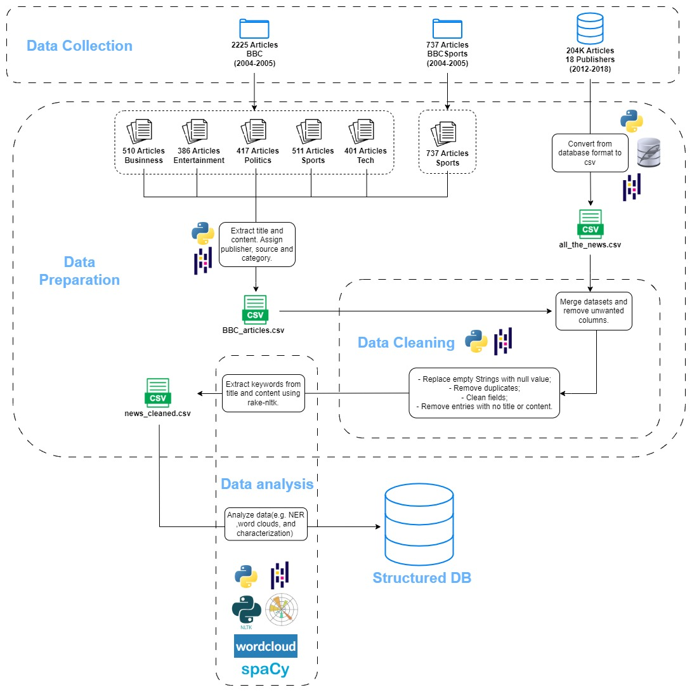
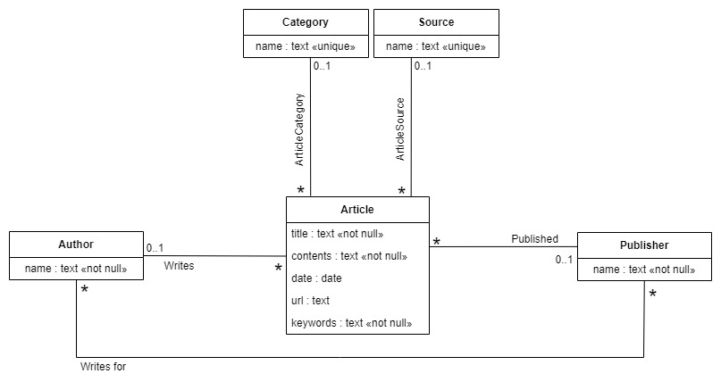

# PRI - Information Processing and Retrieval - FEUP 2023/24

## Project

### M1 Delivery

- [M1 Report](doc/reports/M1_report.pdf)
- [M1 Slides](doc/slides/M1_slides.pdf)

#### Pipeline Diagram

#### Conceptual Model

### M2 Delivery

- [M2 Report](doc/reports/M2_report.pdf)
- [M2 Slides](doc/slides/M2_slides.pdf)

### M3 Delivery

- [M3 Report](doc/reports/M3_report.pdf)
- [M3 Slides](doc/slides/M3_slides.pdf)

## Project developed by:
- Diogo Fonte - up202004175
- Rodrigo Figueiredo - up202005216
- Sofia Rodrigo  - up202301429
- Vítor Cavaleiro - up202004724